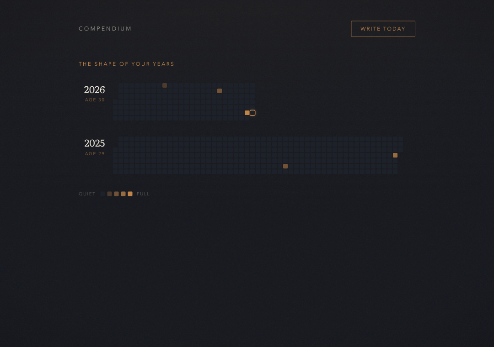

# Compendium

A daily reflection that stays on your device. One entry a day. You have to be here to write it.

Most journaling apps are write-only. You put thoughts in and nothing comes back. Compendium is built on a different premise: most of what we think today is a recurrence of yesterday. So instead of a feed of notes, it keeps a record of *how your thinking moves over time*, and quietly shows you the loops you didn't know you were in.

It is local-first by design. There is no account, no server, and no network call anywhere in the code. Your entries live in your browser's IndexedDB, on your machine, and nowhere else.

## The idea in one line

> A timeline of your recurring thoughts, so you can see whether your thinking is moving or circling.

## A look inside

**The daily ritual.** One free-form entry a day, with a quiet prompt and an optional guidance note.


**The archive.** A heatmap of your writing life, year by year, with the age you were down the left and cell intensity by how much you wrote.



**The thread.** Clicking a day opens its month as a string of beads; hovering previews the day.


**The reader.** Any past day, read back in full.


## What it does

- **One entry per day.** A single free-form writing surface that asks *"What's on your mind today?"* No tags, no fields, no structure. Just thought.
- **You have to be present.** You can only write today's entry, today. There is no backdating, no importing, no bulk entry, and the timestamp is set by the device rather than by you. The constraint is the point: it is a wind-down ritual, not a backlog to clear.
- **Themes emerge. You don't assign them.** Recurring topics surface on their own from your own words.
- **Your history becomes a map.** A GitHub-style heatmap of your writing life (years stacked, with the age you were on each), drilling down to a day-by-day timeline and, eventually, a constellation of the themes you keep returning to.

## Privacy model

Your thoughts never leave your device. This is not a policy, it is an architecture:

- No backend. No authentication. No analytics.
- The code makes zero network requests. You can verify this yourself, which is part of why it is open source.
- The service worker caches only the app's code for offline use. It never touches your entries.
- A manual JSON export gives you a backup that you control.

## Running it

It is a static site with no build step.

```sh
cd compendium
python3 -m http.server 8000
# open http://localhost:8000
```

To install it as an app, open it in a browser and choose "Install" or "Add to Home Screen." It then works fully offline.

## Status

Built in phases. See [BUILDSTORY.md](BUILDSTORY.md) for the full design log and rationale.

- [x] **Phase 1: the writing ritual.** First-run setup, today-only entry, autosave, read-back.
- [x] **Phase 2: the heatmap home.** A year-by-year grid with the age you were down the left, cell intensity by entry length, and a read-only view of any past day.
- [x] **Phase 3: the thread drilldown.** Clicking a day opens its month as a string of day-beads, with a preview on hover and the full entry on click.
- [ ] **Phase 4: local pattern detection.** Recurring themes, surfaced from your own words, with no AI.
- [ ] **Phase 5: polish, backup, deploy.** JSON export and import, PWA install, the calm pass.

Deferred: a constellation theme view, and an optional AI reflection layer (a one-time unlock) that reads patterns across time. The core never depends on it.

## Stack

Vanilla HTML, CSS, and JavaScript. IndexedDB for storage. PWA for offline and install. No framework, no build step, no dependencies.

## License

[MIT](LICENSE). There are no secrets to protect, and open source is what lets anyone confirm the privacy promise is real.
